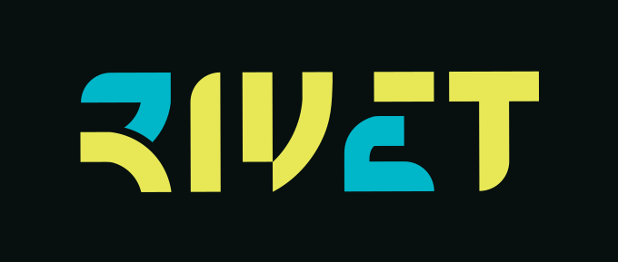

<div align="center">

<!-- El logo va compuesto sobre el fondo de marca: el SVG original combina blanco
     y gris claro, que sobre el tema claro de GitHub desaparecen. Vive en .github/
     y no en public/ para que no viaje al hosting con el build. -->


<!-- Logo de Mashacorp: cuando exista el archivo, va aquí. -->

# Rivet Ecuador

**Ingeniería en alimentos. El producto es la evidencia.**

Frontend del sitio de Rivet Ecuador: formulación, producción y certificación de
alimentos y bebidas. Todo el contenido —textos, catálogo, precios, puntos de venta—
se administra desde el ERP; aquí no hay nada escrito a mano.

<br>

[](https://rivet-ec.com)

<br>


</div>

---

## Qué es

Rivet es una empresa de ingeniería en alimentos, no una licorera: el licor es su
producto de rotación, no su identidad. El sitio trabaja en dos frentes —**capacidad**
(formulación, producción, certificación) y **catálogo**— y le habla a un profesional
del rubro que llega a decidir si contacta.

Este repositorio es **solo el frontend**. Consume la API del ERP por HTTP y se
despliega aparte: el backend nunca sirve estos archivos.

| | |
|---|---|
| **En vivo** | [rivet-ec.com](https://rivet-ec.com) |
| **API** | `https://erp.mashaec.net/api` — dos carriles, CMS y ecommerce |
| **Portal B2B** | El login de la tienda mayorista vive en el ERP, no aquí |
| **Hosting** | cPanel compartido (cuenta `rivetecc`), el mismo que aloja Link Cargo |

---

## Dos carriles de datos que no se mezclan

Es la decisión de arquitectura que más define el proyecto. El mismo ERP expone dos
APIs distintas y cada una tiene su schema, su slice y su función de acceso:

```
/api/cms/{slug}         → contenido editorial   → cmsApi()    → schemas/cms.ts
/api/ecommerce/{slug}   → catálogo y precios    → tiendaApi() → schemas/ecommerce.ts
```

Nunca se cruzan. Un cambio en el catálogo no puede romper el blog, y al revés.

### Carril CMS

| Recurso | Qué trae | Dónde se ve |
|---|---|---|
| `hero` | Portada | `Home` |
| `about` | Quiénes somos | `Nosotros` |
| `services` | Capacidad técnica | `Servicios` |
| `team` | Equipo | `Nosotros` |
| `clients` | Marcas atendidas | `MarcaCliente` |
| `faq` | Preguntas frecuentes | `Faq` |
| `contact` | Datos de contacto | `Contactos`, `Footer` |
| `posts` · `posts/{slug}` | Blog | `Blog`, `PostModal` |
| `puntos-venta` · `puntos-venta/{slug}` | Locales que venden el producto | `PuntosVenta`, `Negocio`, `Menu` |

### Carril ecommerce

| Recurso | Qué trae | Dónde se ve |
|---|---|---|
| `categories` | Árbol de categorías | `Catalogo`, `Categoria` |
| `products` | Catálogo con precio mayorista | `Categoria`, `ProductoCard` |
| `products/featured` | Destacados | `Home` |

El **precio de distribuidor se muestra en público**, con su cantidad mínima. No es un
descuido: el objetivo declarado del sitio es empujar la compra masiva, y el margen es
el argumento de venta.

---

## Los microsites de punto de venta

Cada local que vende producto Rivet tiene dos páginas propias, y son la parte menos
obvia del proyecto:

```
/puntos-venta/{slug}         La ficha del negocio: galería y marca del propio local
/puntos-venta/{slug}/menu    Su carta
```

Van **fuera del `Layout`** a propósito: sin header, sin nav y sin footer de Rivet, y
pintadas con los colores del cliente, no con los de la marca. Son suyas, no de Rivet.

El sitio genera el enlace público de cada una (`lib/config.ts`) para que el local lo
comparta o lo imprima como QR — de ahí la dependencia `qrcode.react`.

---

## Arquitectura

```
schemas/            Los contratos en Zod: cms.ts y ecommerce.ts, separados
       ↓
lib/api.ts          cmsApi() y tiendaApi(): fetch + validación contra el schema
       ↓
stores/recurso.ts   El patrón común de carga (pendiente → cargando → listo → error)
       ↓
stores/             cmsSlices.ts y tiendaSlices.ts, unidos en useAppStore
       ↓
components/         Piden el dato al store y solo lo dibujan
```

**Un fallo de validación se lanza, nunca se traga.** Si el ERP cambia un contrato, el
`ApiError` lo dice con el campo exacto en vez de renderizar la web a medias en
silencio. El error distingue tres causas: `red`, `http` y `validacion`.

`stores/recurso.ts` recoge el ciclo de carga que todos los slices repiten, así que
añadir un recurso nuevo no obliga a reescribir la máquina de estados.

Las páginas se cargan con `lazy()` salvo `Home`, que entra en el bundle inicial: la
primera carga solo paga lo que se ve.

---

## Estructura

```
src/
├── lib/
│   ├── api.ts           Los dos carriles, con validación y ApiError
│   ├── config.ts        Portal B2B, URLs públicas y normalización de WhatsApp
│   ├── imagenes.ts      Resolución de rutas de /storage del ERP
│   └── color.ts         Color de marca de cada punto de venta
├── schemas/
│   ├── cms.ts           Contrato del carril editorial
│   └── ecommerce.ts     Contrato del catálogo
├── stores/
│   ├── useAppStore.ts   Une todos los slices
│   ├── recurso.ts       El ciclo de carga compartido
│   ├── cmsSlices.ts     hero, about, services, team, clients, faq, contact, posts, puntos-venta
│   └── tiendaSlices.ts  categorías y productos, con helpers de árbol
├── components/
│   ├── Header.tsx       Navegación de escritorio
│   ├── BottomNav.tsx    Nav inferior de mobile, con apariencia de app
│   ├── CategoriaCard.tsx
│   ├── ProductoCard.tsx
│   ├── Precio.tsx       Precio público y mayorista con su mínimo
│   ├── MarcaCliente.tsx
│   ├── PostModal.tsx
│   ├── PageHeader.tsx
│   ├── LoadingScreen.tsx
│   ├── TransicionPagina.tsx
│   ├── Seo.tsx          Meta tags por página
│   └── Footer.tsx
├── layout/Layout.tsx    El marco de Rivet; los microsites quedan fuera
└── pages/               Home, Catalogo, Categoria, Producto, Blog, PuntosVenta,
                         Negocio, Menu, Nosotros, Servicios, Contactos, Faq, Postular
```

---

## Sistema de diseño

Los tokens viven en `@theme` dentro de `src/index.css` y Tailwind v4 los consume por
nombre. **Nada de hexadecimales sueltos en los componentes.**

| Token | Valor | Para qué |
|---|---|---|
| `--color-background` | `#07100f` | Fondo. Invariante de marca |
| `--color-primary` | `#00b6c9` | Teal. Acentos y acciones |
| `--color-accent` | `#e8e857` | Amarillo. Realces puntuales |
| `--color-foreground` | `#edf4f6` | Texto |
| `--color-muted-foreground` | `#6a9aaa` | Texto secundario |
| `--color-card` | `#0e1d1f` | Superficies |
| `--color-border` | `#1a3540` | Bordes |

El fondo y la paleta **no cambian**: son invariantes de marca. Nunca `bg-blue-*`.

### Cómo se ve y cómo no

Cuatro anti-referencias confirmadas por el cliente, útiles al proponer cualquier
cambio: no una licorera, no un ecommerce genérico, no un SaaS con gradientes y
métricas gigantes, y no la ejecución del sitio anterior (su paleta sí, su atmósfera
no).

El producto aparece como **evidencia de capacidad técnica**, no como campaña de trago.

### Accesibilidad

WCAG AA, comprometido con el cliente:

- Contraste ≥4.5:1 en texto normal y ≥3:1 en texto grande. Ojo con
  `--color-muted-foreground` sobre el fondo.
- Foco visible y navegación completa por teclado.
- `prefers-reduced-motion` respetado en toda animación, sin excepción.
- Área táctil mínima de 44×44 en el nav inferior de mobile.

---

## Empezar

Hace falta Node 22 o superior.

```sh
npm install
cp .env.example .env.local     # y completa el token
npm run dev
```

| Variable | Para qué |
|---|---|
| `VITE_API_URL` | Base de la API del ERP |
| `VITE_CMS_SLUG` | Identifica a la empresa dentro del ERP (`rivet-ecuador-sas`) |
| `VITE_CMS_TOKEN` | Token de solo lectura |

El token es de **solo lectura** y está limitado a esta empresa. En un frontend público
acaba dentro del bundle, que cualquiera puede leer: es un compromiso asumido a
conciencia para contenido que de todos modos es público. No sirve para escribir nada.

### Comandos

| Comando | Qué hace |
|---|---|
| `npm run dev` | Servidor de desarrollo |
| `npm run build` | Comprueba tipos y compila a `dist/` |
| `npm run preview` | Sirve el `dist/` ya compilado |
| `npm run lint` | Oxlint sobre todo el proyecto |
| `node shot.mjs [url]` | Capturas con Playwright para revisar el render |

---

## Despliegue

Hoy es **manual**: se compila en local y se sube el `dist/` al hosting.

A diferencia de Link Cargo, este proyecto todavía no tiene GitHub Actions. Automatizarlo
es trabajo pendiente y el camino ya está probado en el repositorio hermano: compilar en
el runner y subir por `rsync` sobre SSH, porque **el servidor no tiene Node ni npm**.

Dos cosas que hay que respetar cuando se automatice:

- El `rsync` debe apuntar siempre al directorio del dominio, nunca al home: la cuenta
  de hosting es compartida y aloja otros doce sitios.
- `.well-known/` va excluido del borrado, o falla la renovación del certificado.

Al ser una SPA, el servidor necesita reescribir todas las rutas a `index.html`; sin eso,
recargar en `/catalogo` devuelve 404.

---

## Dónde tocar cada cosa

| Si quieres… | Ve a |
|---|---|
| Cambiar un texto, un precio o un producto | Al ERP, no al código |
| Añadir un recurso del CMS | `schemas/cms.ts` → un slice en `stores/cmsSlices.ts` |
| Añadir algo del catálogo | `schemas/ecommerce.ts` → `stores/tiendaSlices.ts` |
| Cambiar un color de marca | `src/index.css`, el bloque `@theme` |
| Añadir una ruta | `src/App.tsx` y un archivo en `src/pages/` |
| Cambiar el enlace del portal B2B | `src/lib/config.ts` |

---

## Convenciones

- **Todo en español**: componentes, variables, ramas y mensajes de commit.
- **El ERP manda.** Lo que devuelve la API es lo que el cliente administra: no se
  corrige un dato desde el código. Si el diseño necesita un campo que el ERP no
  entrega, se cambia el diseño.
- **El código duro es el respaldo, no la fuente.** Un valor por defecto solo entra
  cuando la API devuelve `null` o no responde.
- **Nada de cálculos en el frontend.** Si hay que sumar o promediar, lo hace el ERP.
- **Lo que se usa dos veces vive en un solo archivo.**

---

<div align="center">

Desarrollado y mantenido por **Mashacorp**

</div>
